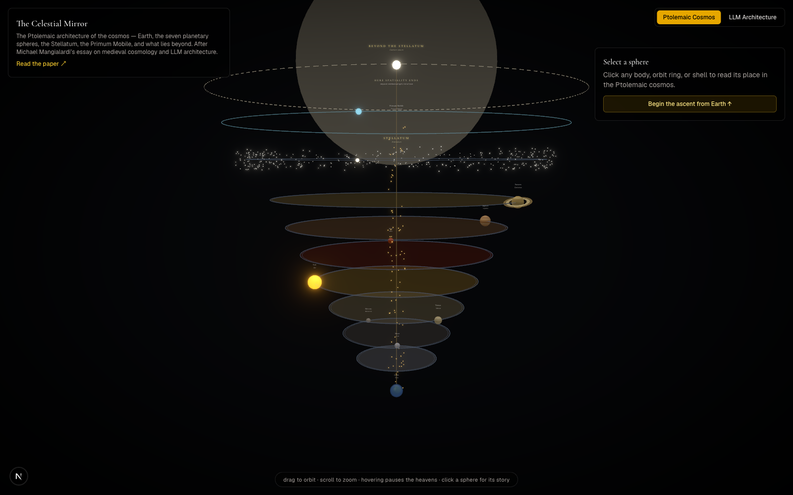

# The Celestial Mirror

**An interactive 3D visualization of the Ptolemaic cosmos — and its mirror in transformer architecture.**

> _"...a series of hollow and transparent globes, one above the other, and each of course larger than the one below."_
> — C.S. Lewis, _The Discarded Image_



Built as a companion to Michael Mangialardi's essay [**The Celestial Mirror: How Medieval Cosmology Reveals the Architecture of (Artificial) Intelligence**](https://michaelmangialardi.substack.com/p/the-celestial-mirror-how-medieval), this app renders the medieval universe exactly as Lewis describes it: not concentric rings viewed from above, but a vertical tower — Earth at the base, "one [sphere] above the other," each larger than the one below, ascending through the seven planets to the Stellatum, the Primum Mobile, and the boundary where geometry itself ends.

Toggle the view, and the same tower becomes a transformer: token input, twelve-odd layers, the fixed embedding constellation, backpropagation — with the same line drawn at the top, marking exactly where the essay argues a language model's geometry cannot follow.

## What it does

- **Climb the tower.** Earth, Moon, Mercury, Venus, Sun, Mars, Jupiter, Saturn, the Stellatum, the Primum Mobile, and the Empyrean beyond — each rendered as its own luminous, textured sphere on its own ring, stacked "one above the other" exactly as Lewis describes.
- **Two readings, one structure.** A header toggle switches every label and info panel between the **Ptolemaic Cosmos** (Lewis, Cicero, Dante, Aquinas) and the **LLM Architecture** parallel the essay draws (transformer layers, attention heads, the fixed embedding space, backpropagation).
- **Nested diagrams.** Selecting a sphere opens small animated diagrams alongside the prose — influence flowing down from a planet to Earth in cosmology mode, syntactic/semantic/entity attention arcs between tokens in LLM mode, the Stellatum's nearest-neighbor embedding comparison (the essay's own Austin/Dallas/Houston example), and more.
- **Guided ascent.** Rung-by-rung navigation (buttons or ↑/↓ keys) with a camera that glides to stand at each sphere's own elevation, or explore freely — drag, pan, and zoom without ever losing your place in the tour.
- **The guided tour.** A planetarium mode that climbs the tower automatically, rung by rung, pausable and exitable at any point — manual clicks re-aim the tour rather than fighting it.
- **The forward pass, live.** Pick a preset prompt and watch one generation cycle on the tower itself: a pulse ascends from the input tokens through the layers, holds at the Stellatum while candidate tokens are compared against the fixed constellation (probability bars and all), then descends — exitus and reditus — and the winner folds back into the sequence. (An illustrative trace, clearly labeled — not a live model.)
- **The boundary, drawn.** A marked line floats between the Primum Mobile and the Empyrean: _"Here spatiality ends"_ in cosmology mode, _"No geometric operation crosses this line"_ in LLM mode — the essay's central claim, made visible. Select the Empyrean and its diagram shows the essay's empirical finding: the first act of the mind carries partway across, judgment and reasoning never do.
- **Intelligences and attention heads.** Faint motes circle each planetary body — the sphere's angelic mover in one reading, the layer's attention heads in the other.
- **The music of the spheres.** Toggle ♪ and each moving sphere sounds its tone, pitch rising with height — Earth (motionless) and the Empyrean (beyond geometry) stay silent; selecting a sphere draws its voice forward.
- **Every rung has a voice — and a touch.** Standing at any rung plays its own quiet ambience, timbre matched to its medieval temperament: Earth's grounded hum, Mercury's chatter, Mars's low growl, Saturn's slow minor third, the Stellatum's shimmering choir of fixed stars, the Empyrean's radiant cluster. Each arrival also taps out that rung's haptic pattern on devices with vibration.
- **The Celestial Rose.** The Empyrean is drawn after Doré's engraving of _Paradiso_ XXXI: a blinding central sun with radiating spokes, ringed — beyond a dark gap — by the slowly wheeling, counter-rotating ranks of the host, always turned to face you.
- **Every rung is a link.** Selection and mode live in the URL (`?rung=mars&view=llm`), with per-sphere titles and Open Graph cards, so any point on the ascent can be shared or cited from the essay.
- **Quiet accessibility.** `prefers-reduced-motion` stills the heavens; resolution adapts to the device's frame rate.

## Stack

- [Next.js](https://nextjs.org) (App Router) + TypeScript
- [React Three Fiber](https://r3f.docs.pmnd.rs/) / [drei](https://github.com/pmndrs/drei) / [Three.js](https://threejs.org) for the 3D scene, with bloom and vignette post-processing
- [Tailwind CSS](https://tailwindcss.com) for the UI overlay
- ESLint + Prettier
- Planet surface maps © [Solar System Scope](https://www.solarsystemscope.com/textures/), licensed [CC BY 4.0](https://creativecommons.org/licenses/by/4.0/)

## Getting started

```bash
npm install
npm run dev
```

Open [http://localhost:3000](http://localhost:3000).

```bash
npm run lint          # ESLint
npm run format        # Prettier — write
npm run format:check  # Prettier — check only
npm run build          # production build (verifies typecheck too)
```

## Deploy

The app is a standard static-friendly Next.js app — deploy it to [Vercel](https://vercel.com) with:

```bash
vercel
```

## Source

Every quote, citation, and cosmological detail is drawn directly from the essay and its primary sources (C.S. Lewis's _The Discarded Image_, Cicero's _Dream of Scipio_, Dante's _Paradiso_, Thomas Aquinas). Read the full essay: **[The Celestial Mirror ↗](https://michaelmangialardi.substack.com/p/the-celestial-mirror-how-medieval)**
